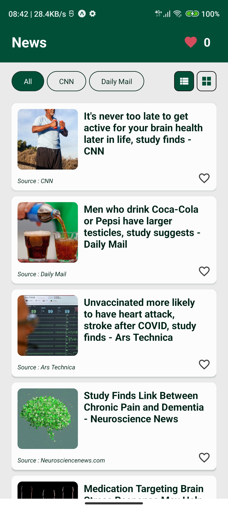

# Code Challenge

---

## Descriptions

This project show all news from `country=us` with `health` category provided by `newsapi.org`. In this challenge, you will be given a task to complete some a ready defined function to complete some certain task.

Futhermore, this is the response snapshot from the newsapi.org with health category and US as the source country

``` JSON
"totalResults": 67,
"articles": [
    {
        "source": {
            "id": "cnn",
            "name": "CNN"
        },
        "author": "Madeline Holcombe",
        "title": "It's never too late to get active for your brain health later in life, study finds - CNN",
        "description": "Lifelong physical activity may be the best way to stay healthy, but what about those haven't gotten started yet? A new study finds that it is always beneficial to cognitive well-being to incorporate some activity — even if it isn't too intensive.",
        "url": "https://www.cnn.com/2023/02/21/health/exercise-any-age-wellness/index.html",
        "urlToImage": "https://media.cnn.com/api/v1/images/stellar/prod/230221145924-01-exercise-any-age-weights-wellness-stock.jpg?c=16x9&q=w_800,c_fill",
        "publishedAt": "2023-02-21T23:31:00Z",
        "content": "Sign up for CNNs Fitness, But Better newsletter series. Our seven-part guide will help you ease into a healthy routine, backed by experts. \r\nEven if youve never been physically active, you can start … [+4059 chars]"
    },
    {
        "source": {
            "id": null,
            "name": "Daily Mail"
        },
        "author": "Caitlin Tilley",
        "title": "Men who drink Coca-Cola or Pepsi have larger testicles, study suggests - Daily Mail",
        "description": "Research on mice showed adult males who drank Coca-Cola or Pepsi had higher testosterone levels and larger testicles than their peers. The unusual finding seems to contradict previous studies.",
        "url": "https://www.dailymail.co.uk/health/article-11776783/Men-drink-Coca-Cola-Pepsi-larger-testicles-study-mice-suggests.html",
        "urlToImage": "https://i.dailymail.co.uk/1s/2023/02/21/17/67927359-0-image-a-12_1677000201741.jpg",
        "publishedAt": "2023-02-21T23:01:18Z",
        "content": "The country's most popular sodas might refresh the parts other drinks can't reach - by giving men bigger testicles and making them more masculine, a study suggests. \r\nResearch on mice showed adult ma… [+2906 chars]"
    },
]
```

## Getting Started

This project is build with `expo-app` and consist with 3 different files

- `App.js` and entry point for the project where all component is rendered
- `App.Components` all local component is constuct in this file
- `App.Styles` contain all styles ans contants for all component
- `Service.Api` to handle nework call

## How to Run The Project?

- firstly, you must `fork` this origin repo to your current GitHub repo. Then, you can begin modify this project localy by clone `(git clone remote-url...)` your `forked repositoy` to your local machine.
- goto to `newsapi.org` and sign-up to get the `apiKey`
- after you get the key, copy the `apiKey` and change the `API_KEY` value on `Service.Api.js` file with your new `apiKey`
- open termial or command-line on the poject directory and run `yarn install` or `npm install`, make sure you has `nodejs` environtment and `npm` or `yarn` package manager in your local machine
- connect your android device or run your simulator on local machine. Then, install `Expo-Go` app from app store or play store to your android device or simulator
- do command `yarn android` to run the project on android or change to ios if you want to run on ios device

## Task or Challenge

- Complete `onLoveSelect` event to handle `love count number` in header component. Your task is to make the love button on the news card change its color to `Color.error` when its selected or pressed. Then, increase love count number on the header component. When user press again the same love button, change the color to its original state and decrese the love count number
- Do local data filter for rendered news card. When user click the chip button, the card will be filtered by the selected news source `localy` without requesting new data via network call
- **BONUS** : change grid or list view of the news card by selecting the gird or list icon on the filter component


